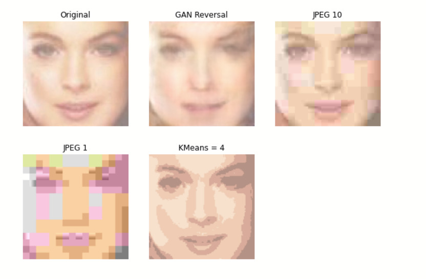
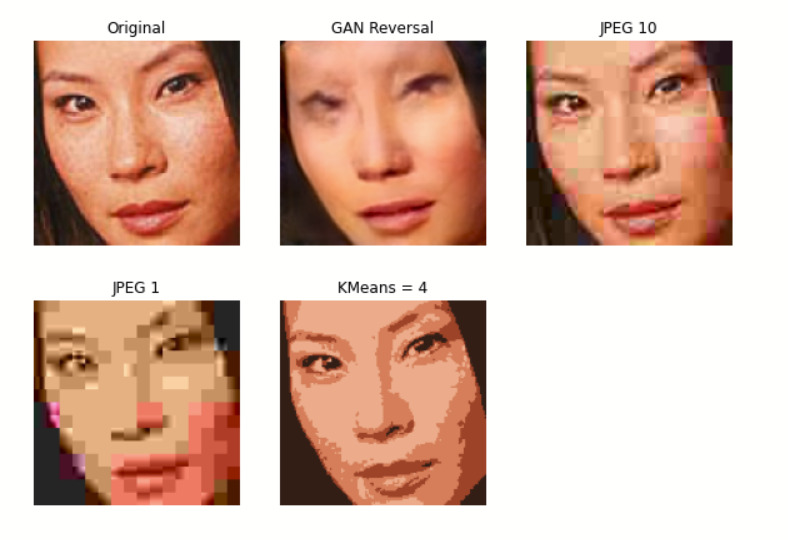
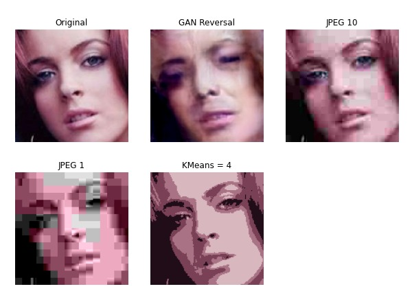
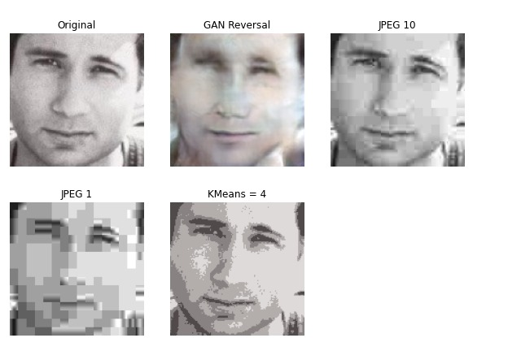

# Generative Neural Network Based Image Compression

Traditional off-the-shelf lossy image compression techniques such as JPEG and WebP are not designed specifically for the data being compressed, and therefore do not achieve the best possible compression rates for images.

We implement the pipeline described in [this](https://cs229.stanford.edu/proj2018/report/44.pdf) paper that describes the use of GANs for effective image compression on a specific domain of images (in this case human faces).

We make use of the ProGAN-128 pretrained GAN model from tfhub for this. Note that this model explicitly required the use of TensorFlow 1 for its use.

Here are some of the results from our work:

## MSE, SSIM, PSNR Combined

## MSE Loss 

